<div align="center">





<p>
  
  
  
</p>

<p>
  <a href="https://www.linkedin.com/in/hamza-ali-k712" target="_blank"></a>
  <a href="mailto:hamzatalwarali712@gmail.com"></a>
  <a href="https://personal-portfolio-beta-ten-54.vercel.app/" target="_blank"></a>
  <a href="https://github.com/hamzaali-712" target="_blank"></a>
</p>

</div>

---

## 🧠 About Me



I’m a driven Software Engineering student at COMSATS University Islamabad, Wah Campus, with a strong interest in AI, machine learning, secure systems, and building practical software that solves real-world problems. I currently work as a Machine Learning Intern at FlyRank AI and enjoy turning ideas into reliable products through academic projects, hackathons, and hands-on internships.

- 🎓 BS Software Engineering — COMSATS University Islamabad, Wah Campus
- 🤖 Machine Learning Intern @ FlyRank AI
- 🔐 Exploring cybersecurity, secure design, and applied AI
- 🧱 Interested in data structures, systems thinking, and low-level engineering fundamentals
- 🌍 Focus areas: AI · Cybersecurity · Software Development · Product-minded engineering
- 📫 Reach me at hamzatalwarali712@gmail.com

<br clear="right" />

---

## ⚡ Current Focus

- Building practical AI workflows and ML-backed solutions
- Strengthening foundations in secure software design and systems thinking
- Collaborating on impactful projects in education, automation, and AI
- Continuously improving as a developer through internships, exploration, and open-source work

---

## 🛠️ Tech Stack

<p align="left">
  
</p>

- AI & Data Science: Machine Learning fundamentals · NLP · Applied ML workflows
- Languages: Python · C++ · C · JavaScript · HTML · CSS
- Tools: VS Code · IntelliJ IDEA · GitHub · ClickUp · Microsoft Office Suite
- Interests: Cybersecurity fundamentals · Secure system design · Product-minded development

---

## 📊 GitHub Stats

<div align="center">


</div>

<div align="center">
  
  
</div>

<div align="center">
  
  
</div>

---

## 🏆 Trophies & Milestones

<div align="center">
  
</div>

<div align="center">
  
</div>

<div align="center">
  
</div>

> The contribution animations above are generated by [.github/workflows/github-snake.yml](.github/workflows/github-snake.yml) and [.github/workflows/profile-3d.yml](.github/workflows/profile-3d.yml) and updated automatically.

---

## 💼 Experience & Education

- 2026 — Present: Machine Learning Intern at FlyRank AI
- 2025 — 2026: Project Management Trainee with Saint Louis University × Excelerate
- 2023 — Present: Active contributor to academic, hackathon, and community-driven tech projects
- Education: BS Software Engineering, COMSATS University Islamabad, Wah Campus

---

## 🚀 Featured Projects

| Project | Focus | Stack |
| :-- | :-- | :-- |
| Safar AI | Route prediction and intelligent travel planning | Python · ML · NLP |
| MediScript AI | Prescription understanding and healthcare intelligence | Python · Streamlit · AI APIs |
| ShieldPay | Scam detection and financial safety workflows | React · Express · AI APIs |
| Cyber Crime Reporting System | Secure reporting and evidence-based system design | Next.js · TypeScript · FastAPI |
| MBPLDS | DSA-focused security tooling and algorithmic problem solving | C++ · DSA · Algorithms |

<div align="center"><sub>Explore more repositories → <a href="https://github.com/hamzaali-712?tab=repositories">github.com/hamzaali-712</a></sub></div>

---

## 📜 Certifications & Achievements

<div align="center">
  
  
  
  
  
</div>

- 🏅 Hackathons: 4.0 Code War Hackathon · HackData V1 · Global AI Hackathon 5.0
- 📚 Continuous learning in AI, cybersecurity, and modern software engineering

---

## ☕ Fun Zone

> “A great programmer thinks about the program on a constant basis, whether driving or eating. Their method takes an incredible amount of mental energy.”

```text
$ whoami
> Hamza Ali — building secure, intelligent systems, one commit at a time.
```

---

## 🌐 Connect & Collaborate

<p align="center">
  <a href="https://www.linkedin.com/in/hamza-ali-k712" target="_blank"></a>
  <a href="https://github.com/hamzaali-712" target="_blank"></a>
  <a href="https://personal-portfolio-beta-ten-54.vercel.app/" target="_blank"></a>
  <a href="mailto:hamzatalwarali712@gmail.com"></a>
</p>

<div align="center">
  
  <sub>Made with ❤️ by Hamza Ali · © 2026</sub>
</div>
